# Architecture applicative — MAT (Mézières Avec Toi)

> **Documentation centrale d'architecture.** Schémas (rendus nativement par GitHub via Mermaid,
> sans dépendance externe) décrivant l'architecture technique de MAT : vues de contexte, de
> conteneurs et de déploiement, flux métier clés, fonctionnement hors-ligne et modèle de données.
>
> Documents liés : [README](../README.md) · [Guide technique](guide-technique.md) ·
> [Référentiel de spécifications (MOA)](specifications/README.md) ·
> [Cartographie visuelle des services](../architecture.html) (page interactive).
>
> 🔄 **Document vivant** — à mettre à jour à chaque évolution structurante de l'architecture.

---

## Sommaire

1. [Vue d'ensemble (contexte)](#1-vue-densemble-contexte)
2. [Vue des conteneurs](#2-vue-des-conteneurs)
3. [Vue de déploiement](#3-vue-de-déploiement)
4. [Flux métier clés (séquences)](#4-flux-métier-clés-séquences)
   - [4.1 Assistant MEL](#41-assistant-mel-pipeline-de-réponse)
   - [4.2 Import d'actualité (webhook Facebook)](#42-import-dactualité--webhook-facebook)
   - [4.3 Publication multi-canal (back-office)](#43-publication-multi-canal-back-office)
   - [4.4 Signalement citoyen](#44-signalement-citoyen--trello--push)
   - [4.5 Notifications push (abonnement + envoi)](#45-notifications-push-abonnement--envoi)
   - [4.6 Météo & vigilance (cron)](#46-météo--vigilance-cron-automatique)
5. [Fonctionnement hors-ligne (PWA)](#5-fonctionnement-hors-ligne-pwa)
6. [Modèle de données](#6-modèle-de-données)

---

## 1. Vue d'ensemble (contexte)

MAT est un portail citoyen composé d'un **frontend statique (PWA)** et d'un **backend Node.js**,
adossés à un **cache Redis** et à un ensemble d'**API tierces** (IA souveraine, données publiques,
services communaux).

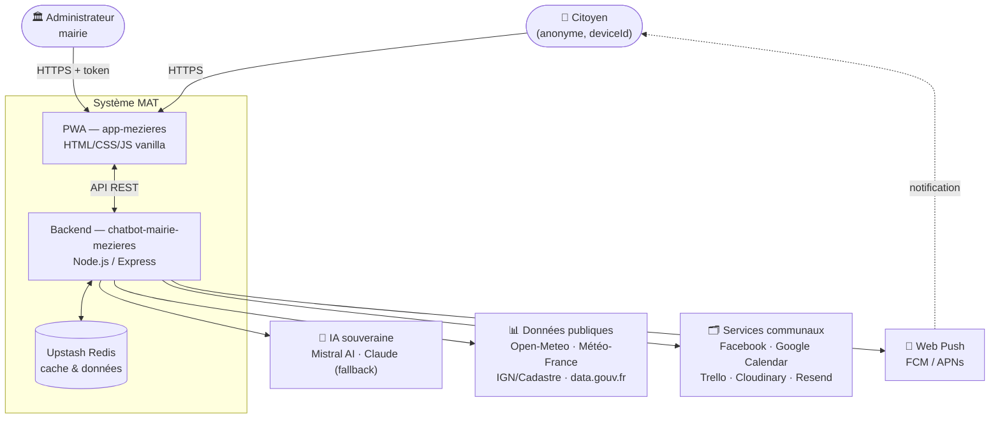

**Principes structurants**
- **Frontend 100 % statique** : aucun build, aucun bundler, aucune dépendance CDN au runtime
  (Leaflet, polices, Sentry auto-hébergés).
- **Anonymat** : pas de compte, identification technique par `deviceId` (cf.
  [SFG §2](specifications/SFG-specifications-generales.md)).
- **Souveraineté** : IA prioritaire Mistral (France), données applicatives en UE.

---

## 2. Vue des conteneurs

Détail des composants internes et de leurs responsabilités.

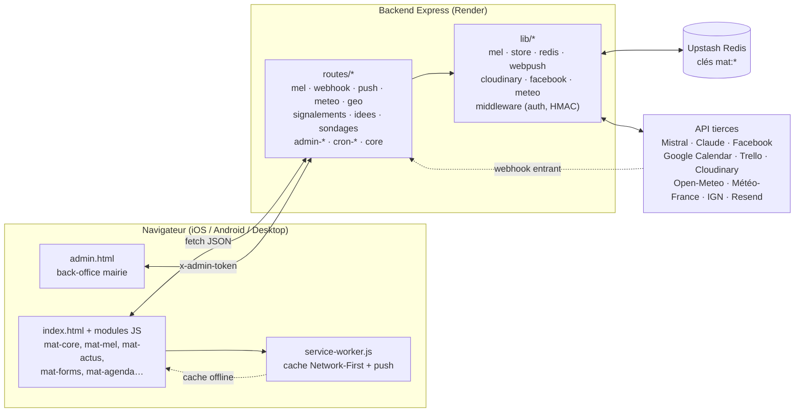

Référence détaillée des fichiers : [Guide technique §2](guide-technique.md#2-dépôts-et-structure-des-fichiers).

---

## 3. Vue de déploiement

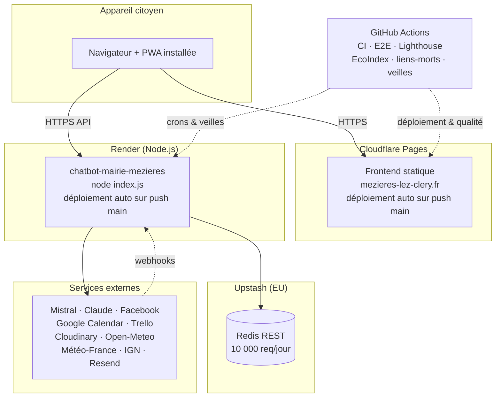

> ⚠️ **Migration Render prévue en août 2026** (fin du plan Free) — prévoir le passage en
> Starter (cf. [Guide technique §11](guide-technique.md#11-déploiement)).

---

## 4. Flux métier clés (séquences)

### 4.1 Assistant MEL (pipeline de réponse)

Priorité aux réponses **sans appel IA** (règles directes, cache), puis **Mistral**, puis **Claude**
en repli, et enfin une réponse statique si tout est indisponible.

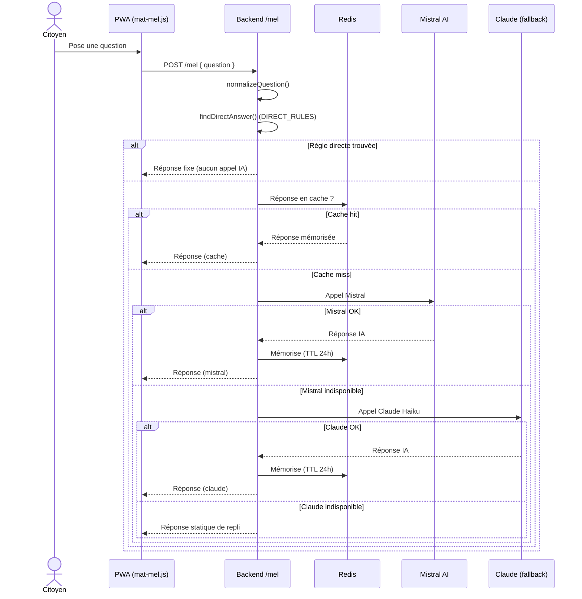

Détail des règles (quotas, anti-injection, valeur non juridique) :
[SFD-02](specifications/sfd/SFD-02-assistant-mel.md).

### 4.2 Import d'actualité — webhook Facebook

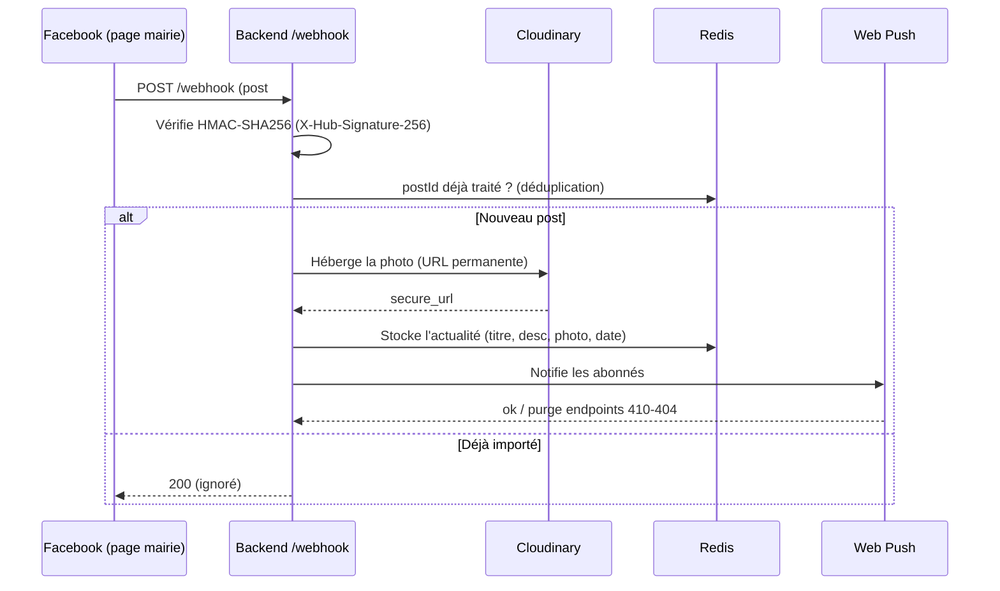

Détail : [SFD-01](specifications/sfd/SFD-01-actualites.md).

### 4.3 Publication multi-canal (back-office)

Publication **atomique** : si Facebook échoue, l'image Cloudinary est nettoyée (rollback).

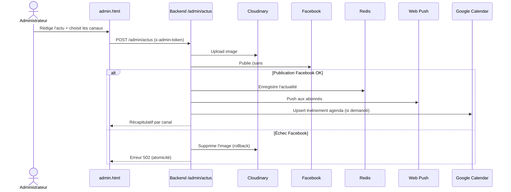

Détail : [SFD-14](specifications/sfd/SFD-14-administration-backoffice.md).

### 4.4 Signalement citoyen → Trello → push

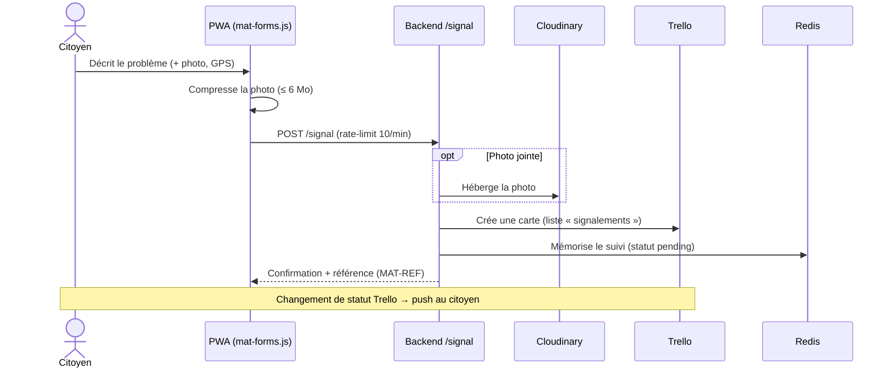

Détail : [SFD-03](specifications/sfd/SFD-03-signalements.md) ·
[SFD-12](specifications/sfd/SFD-12-contact-demandes.md).

### 4.5 Notifications push (abonnement + envoi)

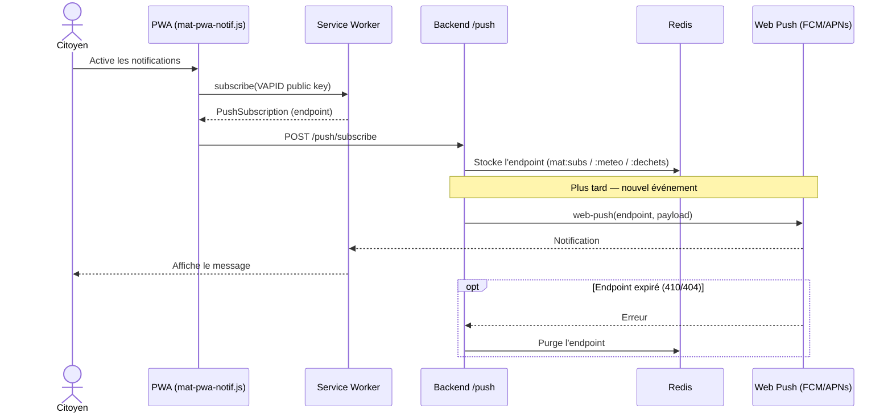

Détail : [SFD-08](specifications/sfd/SFD-08-notifications-push.md).

### 4.6 Météo & vigilance (cron automatique)

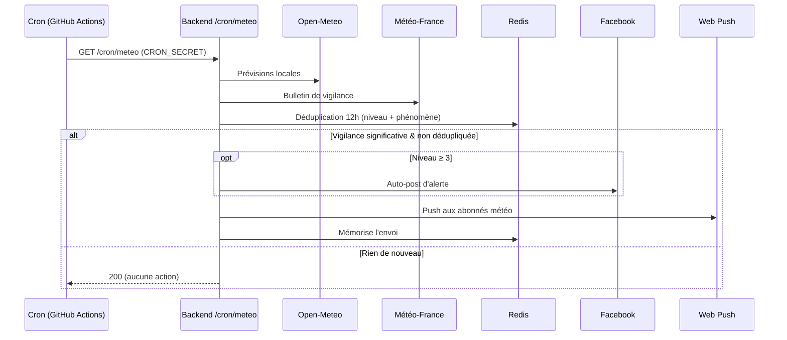

Détail : [SFD-09](specifications/sfd/SFD-09-meteo-vigilance.md) ·
[SFD-10](specifications/sfd/SFD-10-dechets-collecte.md) ·
[SFD-15](specifications/sfd/SFD-15-supervision-conformite.md).

---

## 5. Fonctionnement hors-ligne (PWA)

Le service worker applique une stratégie **Network-First** : réseau d'abord, repli sur le cache
versionné en cas d'échec. L'app reste consultable hors-ligne, et n'affiche jamais de fausse donnée.

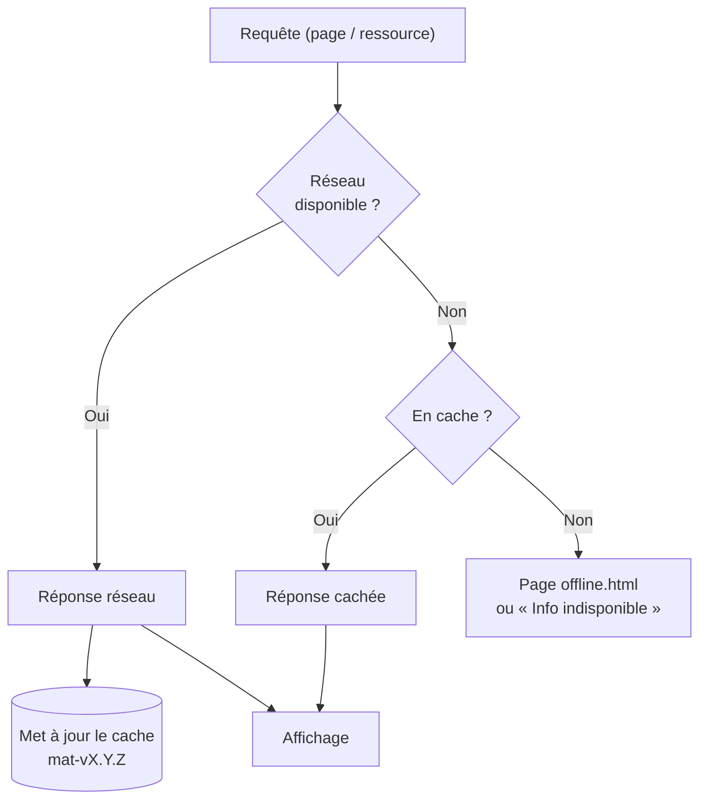

- **Versionnement** : constante `CACHE = 'mat-vX.Y.Z'` dans `service-worker.js`, incrémentée à
  chaque déploiement frontend (cf. [CLAUDE.md](../CLAUDE.md) et
  [Guide technique §7](guide-technique.md#7-pwa-et-service-worker)).
- **Écritures hors-ligne** : brouillons de formulaires conservés en `localStorage`, envoi différé
  (cf. [SFD-03](specifications/sfd/SFD-03-signalements.md), [SFD-12](specifications/sfd/SFD-12-contact-demandes.md)).

---

## 6. Modèle de données

Les données applicatives sont stockées dans **Upstash Redis** sous des clés préfixées `mat:*`
(vue de synthèse ci-dessous ; détail et plafonds dans
[SFG §5](specifications/SFG-specifications-generales.md#5-vue-densemble-du-modèle-de-données)).

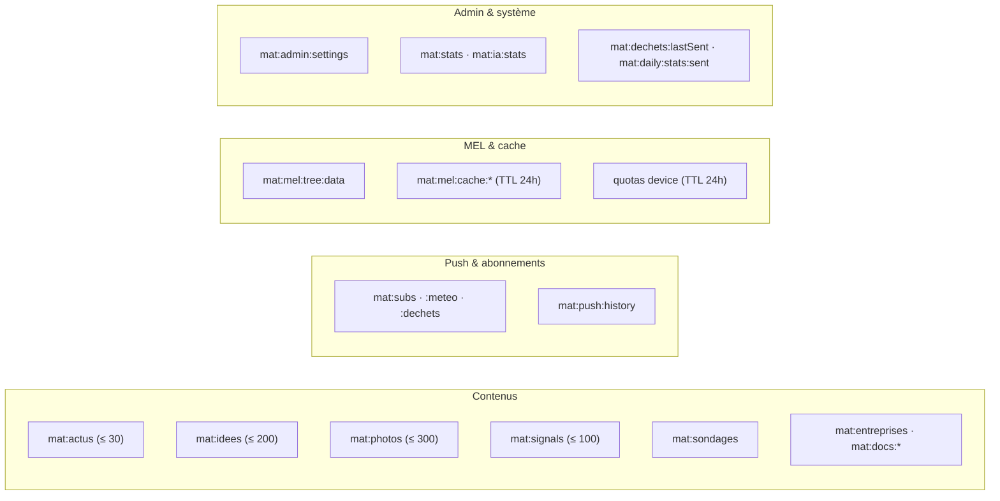

Côté **client**, les préférences et brouillons sont en `localStorage`
(`mat_accessibility`, `mat_contact_form_state`, `mat_my_signals_v1`…).

---

*Application MAT — Commune de Mézières-lez-Cléry — Licence MIT*
